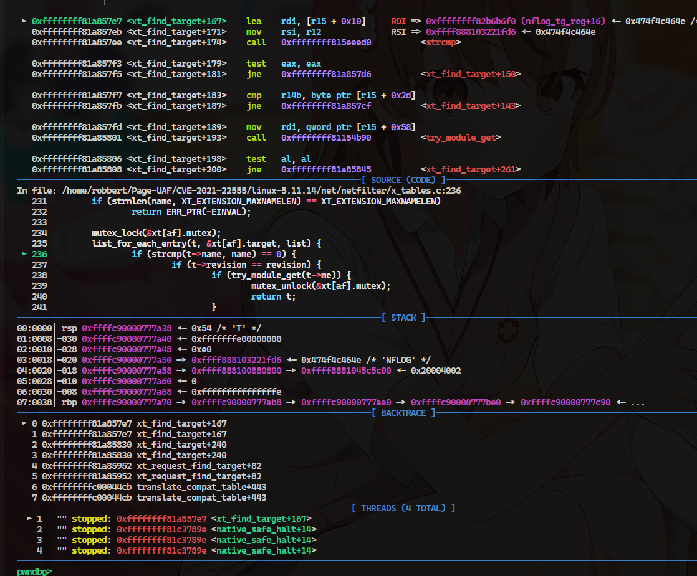

```c
struct xt_table_info *xt_alloc_table_info(unsigned int size)
{
	struct xt_table_info *info = NULL;
	size_t sz = sizeof(*info) + size;

	if (sz < sizeof(*info) || sz >= XT_MAX_TABLE_SIZE)
		return NULL;

	info = kvmalloc(sz, GFP_KERNEL_ACCOUNT);
	if (!info)
		return NULL;

	memset(info, 0, sizeof(*info));
	info->size = size;
	return info;
}
EXPORT_SYMBOL(xt_alloc_table_info);

static int
compat_do_replace(struct net *net, sockptr_t arg, unsigned int len)
{
	int ret;
	struct compat_ipt_replace tmp;
	struct xt_table_info *newinfo;
	void *loc_cpu_entry;
	struct ipt_entry *iter;

	if (copy_from_sockptr(&tmp, arg, sizeof(tmp)) != 0)
		return -EFAULT;

	/* overflow check */
	if (tmp.num_counters >= INT_MAX / sizeof(struct xt_counters))
		return -ENOMEM;
	if (tmp.num_counters == 0)
		return -EINVAL;

	tmp.name[sizeof(tmp.name)-1] = 0;

	newinfo = xt_alloc_table_info(tmp.size);
	if (!newinfo)
		return -ENOMEM;

    ...
	ret = translate_compat_table(net, &newinfo, &loc_cpu_entry, &tmp);
    ...
}

static int
translate_compat_table(struct net *net,
		       struct xt_table_info **pinfo,
		       void **pentry0,
		       const struct compat_ipt_replace *compatr)
{
	unsigned int i, j;
	struct xt_table_info *newinfo, *info;
	void *pos, *entry0, *entry1;
	struct compat_ipt_entry *iter0;
	struct ipt_replace repl;
	unsigned int size;
	int ret;

	info = *pinfo;
	entry0 = *pentry0;
	size = compatr->size;
	info->number = compatr->num_entries;

	j = 0;
	xt_compat_lock(AF_INET);
	ret = xt_compat_init_offsets(AF_INET, compatr->num_entries);
	if (ret)
		goto out_unlock;
	/* Walk through entries, checking offsets. */
	xt_entry_foreach(iter0, entry0, compatr->size) {
		ret = check_compat_entry_size_and_hooks(iter0, info, &size,
							entry0,
							entry0 + compatr->size);
		if (ret != 0)
			goto out_unlock;
		++j;
	}

	ret = -EINVAL;
	if (j != compatr->num_entries)
		goto out_unlock;

	ret = -ENOMEM;
	newinfo = xt_alloc_table_info(size);
	if (!newinfo)
		goto out_unlock;

	newinfo->number = compatr->num_entries;
	for (i = 0; i < NF_INET_NUMHOOKS; i++) {
		newinfo->hook_entry[i] = compatr->hook_entry[i];
		newinfo->underflow[i] = compatr->underflow[i];
	}
	entry1 = newinfo->entries;
	pos = entry1;
	size = compatr->size;
	xt_entry_foreach(iter0, entry0, compatr->size)
		compat_copy_entry_from_user(iter0, &pos, &size,
					    newinfo, entry1);
}


static void
compat_copy_entry_from_user(struct compat_ipt_entry *e, void **dstptr,
			    unsigned int *size,
			    struct xt_table_info *newinfo, unsigned char *base)
{
	struct xt_entry_target *t;
	struct ipt_entry *de;
	unsigned int origsize;
	int h;
	struct xt_entry_match *ematch;

	origsize = *size;
	de = *dstptr;
	memcpy(de, e, sizeof(struct ipt_entry));
	memcpy(&de->counters, &e->counters, sizeof(e->counters));

	*dstptr += sizeof(struct ipt_entry);
	*size += sizeof(struct ipt_entry) - sizeof(struct compat_ipt_entry);

	xt_ematch_foreach(ematch, e)
		xt_compat_match_from_user(ematch, dstptr, size);
    ...
}

void xt_compat_match_from_user(struct xt_entry_match *m, void **dstptr,
			       unsigned int *size)
{
	const struct xt_match *match = m->u.kernel.match;
	struct compat_xt_entry_match *cm = (struct compat_xt_entry_match *)m;
	int pad, off = xt_compat_match_offset(match);
	u_int16_t msize = cm->u.user.match_size;
	char name[sizeof(m->u.user.name)];

	m = *dstptr;
	memcpy(m, cm, sizeof(*cm));
	if (match->compat_from_user)
		match->compat_from_user(m->data, cm->data);
	else
		memcpy(m->data, cm->data, msize - sizeof(*cm));
	pad = XT_ALIGN(match->matchsize) - match->matchsize;
	if (pad > 0)
		memset(m->data + match->matchsize, 0, pad);

	msize += off;
	m->u.user.match_size = msize;
	strlcpy(name, match->name, sizeof(name));
	module_put(match->me);
	strncpy(m->u.user.name, name, sizeof(m->u.user.name));

	*size += off;
	*dstptr += msize;
}
```

How to find a suitable target ?
-> Check xt_find_target, there is are global variable xt contains the link list for searching all availble targets




target with name "NFLOG" and revision 0 has the largest size!

